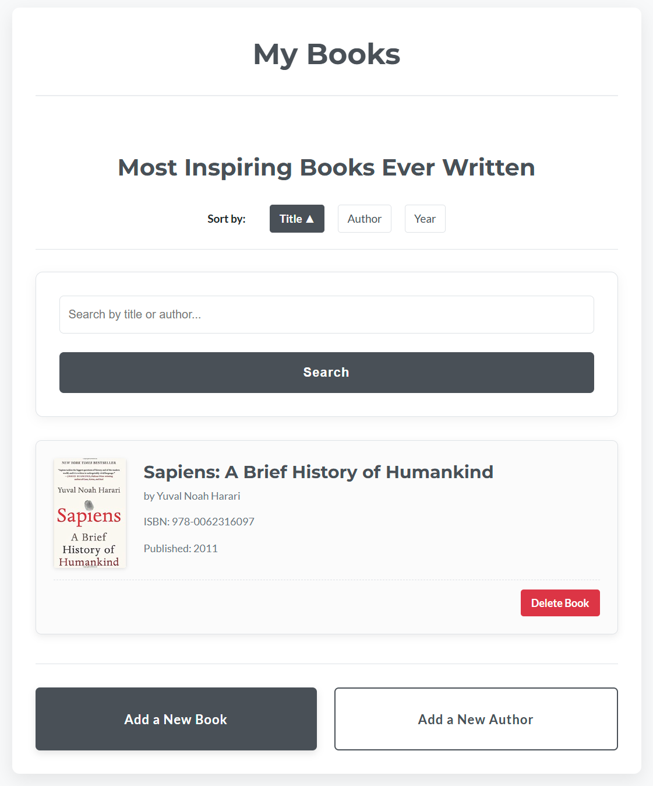

# My Books

This app aims at collecting all your favorite books (or all that you want really) and display this collection into a beautiful HTML frontend.



## Installation

To install this app, simply clone the repository and install the dependencies in requirements.txt using `pip`

```bash
   pip install -r requirements.txt
```

## Usage

To use this app, run the following command `python app.py`

On the homepage, you are presented with all the favorites books that have been added to the database
> - You may sort the list by title, author, or year
> - You may search for a title or an author
> - You may delete a specific book
> - You may add a new author
> - You may add a new book (provided that its author already exists)

## Project Status

As of _01-JUL-2025_, project is: _in progress_

## Room for Improvement

> - Detailed page for each book
> - Detailed page for each author
> - Delete an author
> - Book rating
> - Based on list, AI could recommend a future read...

## Acknowledgements

A special thanks to the entire team at Masterschool for providing the guidance in building this app.

## Contributing

I welcome any contributions! If you'd like to contribute to this project, please reach out to [email@edgroell.com](mailto:email@edgroell.com)